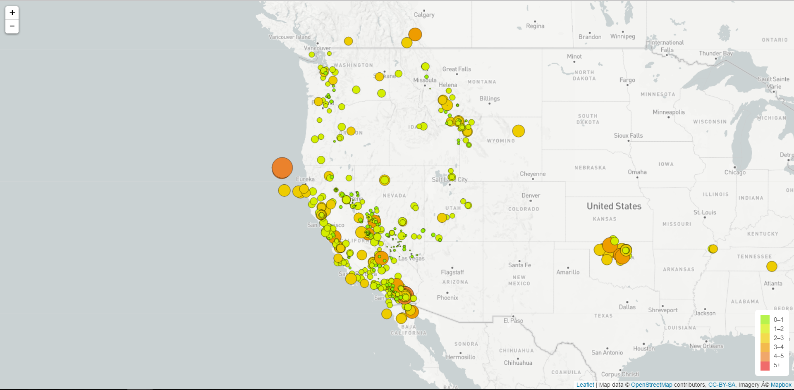

# Visualizing Earthquake Data with Leaflet

This application creates a map using Leaflet and plots all of the earthquakes from USGS based on their longitude and latitude. The data markers reflect the magnitude of the earthquake in their size and color. Earthquakes with higher magnitudes are appear larger and darker in color. Popups provide location, date and magnitude about the earthquake when a marker is clicked. A legend provides context for the map data.

